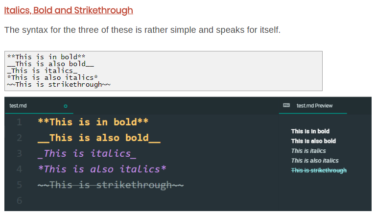

# MarkdownExamples
Some mark down language example applied only on README.MD. 
\# Is a heading. 
\#\# Also indicates heading, but with smaller font size. 
\#\#\# You can go on to consecutively smaller sizes 
# Is a heading.
## Also indicates heading, but with smaller font size.
### You can go on to consecutively smaller sizes
\_\_\_
___
Another section after triple underscore. 

\> This is a sybsection written by starting a \> greater than sign. 
> This is a sybsection written by starting a \> greater than sign.
 
This is a hyperlink \[nervoustech rock\]\(http://nervoustech.com:8090\) 
This is a hyperlink [nervoustech rock](http://nervoustech.com:8090)
This is image  .
